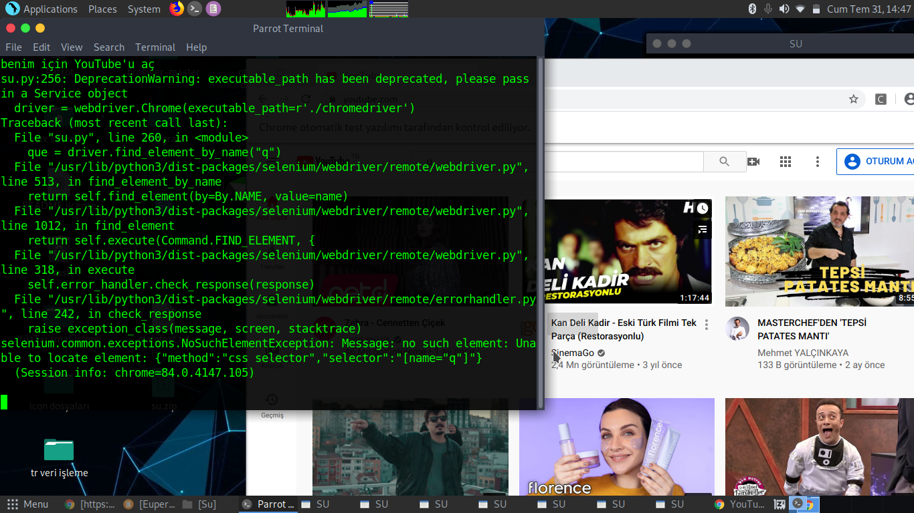

# ➤ USING VOICE ASSISTANT SU
```
chmod +x chromedriver

sudo python3 su.py

Bunların Dışında Kurulu Olan Linux Dağıtımınız da Google Chrome 
Tarayıcısnının Kurulu Olması Gerekmektedir.

https://chromedriver.chromium.org/ > Eğer ChromeDriver'ı
Bu Link Üzerinden Güncelliyebilirsiniz.

```
# ➤ :octocat: FEATURES
```
1) Youtube'dan birşeyler araştırabilir
2) spotifyı açabilir
3) Hava Drumunu Öğrenebilir
4) Not tutabilir
5) İstediğiniz şeyleri internette arayabilir
6) Metin yazdırabilir
7) Bildirim kurabilir
8) Bilgisayarı kapayabilirsiniz.
```
# ➤ :book: LINKS

Web Sitesi :[euperline.com](euperline.com)
</br>
Instagram : [instagram.com](https://www.instagram.com/euperlineofficial/)
</br>
LinkedIn :  [linkedin.com](https://www.linkedin.com/company/euperline/)
