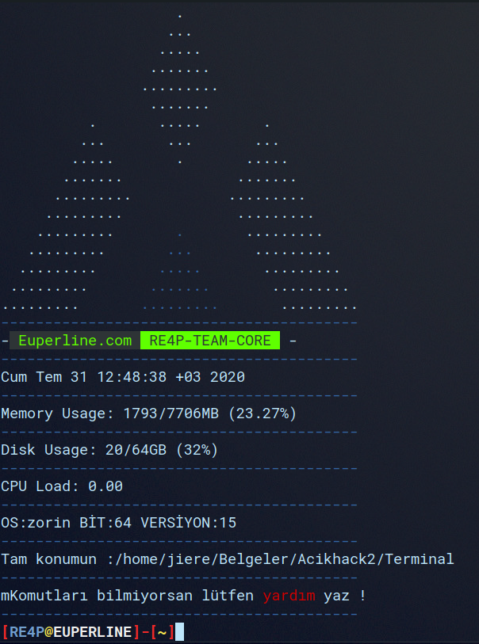

# ➤ EUPERLINE@RE4P
```
> Terminal (V1)
```
# ➤ :scroll: INSTALLATION
```
Terminalimizi Çalıştırmadan Önce İndirilmesi Gereken Paketleri Kurmak İçin...

> sudo bash re4p_paket.sh || ./re4p_paket.sh

```
# ➤ :octocat: RUN IN TERMINAL  
```
cd Euperline

./re4p.sh || sudo bash re4p.sh
```
# ➤ :heavy_exclamation_mark: TESTED ON
```  
> Kalsedon OS
> Zorin OS
> Parrot OS
> Ubuntu
> Debian
```

# ➤ :book: LINKS

Web Sitesi : [euperline.com](euperline.com)
</br>
Instagram : [instagram.com](https://www.instagram.com/euperlineofficial/)
</br>
LinkedIn :  [linkedin.com](https://www.linkedin.com/company/euperline/)
