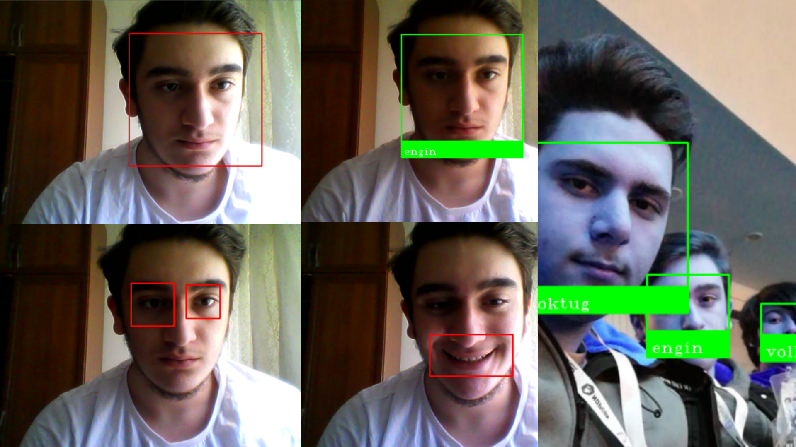

# ➤ Face Id yi Çalıştırmadan Önce İndirmeniz Gerekenler
```
> sudo apt-get install python
> sudo pip install face_recognition
> sudo pip install opencv-python
```

# ➤ Face ID ÖZELLİKLERİ
```
1) Yüz hatlarına göre güvenlik sistemi
2) Göz, ağız ve yüz hatlarına göre güvenlik sistemi
3) Duygu değişimi anla vb.

özelliklerle birlikte kullanıldığından kullanıcı adına bilgi toplayarak onun için farklı altarnetifler oluşturarak güvenliğini sağlar.
```

# ➤ TARAMA YAPMAK İÇİN
```
1) Resim İle Yüz Taraması Yapma İçin


      python resim_ile_yuz_tarama.py test1.jpg yuzler/


      (Halinde Kodu Çalistirabilirsiniz.)

(yuzler) dosyası içine koymak istediğiniz resminizi (.jpg) halinde yüklemeniz gerekmekte.

Test etmek istediğiniz resmi ise (resim_ile_yuz_tarama) dosyasının içine (test1.jpg) ismini vererek yapabilirsiniz.


2) Kamera İle Yüz Tarama Yapacak İseniz

      python kamera_ile_yuz_tarama.py yuzler/

      (Halinde Kodu Çalistirabilirsiniz.)


(yuzler) dosyasi içine koymak istediğiniz resminizi (.jpg) uzantılı şekilde yüklemeniz gerekmete.
```

# ➤  Sistemin sizi daha ayırt etmesi açısından dosyaların içine yüklemiş olduğunuz resimler
```
1) Karanlık bir ortamda çekilmemiş olmalı
2) Güncel ve yeni halinizin bulunduğu bir reim olmalı
3) Yüzünüz görünüyor olmalıdır.


3) Yüz Tanıma Sistemi

 Yüz tanıma sistemi sadece kullanıcının yüzdeki belirli bölgeleri taraması için yapılmıştır.


     < Gözünüzü taramak isterseniz >

     python goz_dedektor.py


    kodunu yazarak gözünüzü tarayabilirsiniz.


    < Gülümsemenizi taramak isterseniz >

    python gulumseme_taraması.py

    kodunu yazarak gülümsemenizi tarayabilirsiniz.


    < Yüzünüzü taratmak isterseniz >

    python yuz_tarayıcı.py

    kodunu yazarak gülümsemenizi tarayabilirsiniz.
```



# ➤ :book: LINKS

Web Sitesi : [euperline.com](euperline.com)
</br>
Instagram : [instagram.com](https://www.instagram.com/euperlineofficial/)
</br>
LinkedIn :  [linkedin.com](https://www.linkedin.com/company/euperline/)
