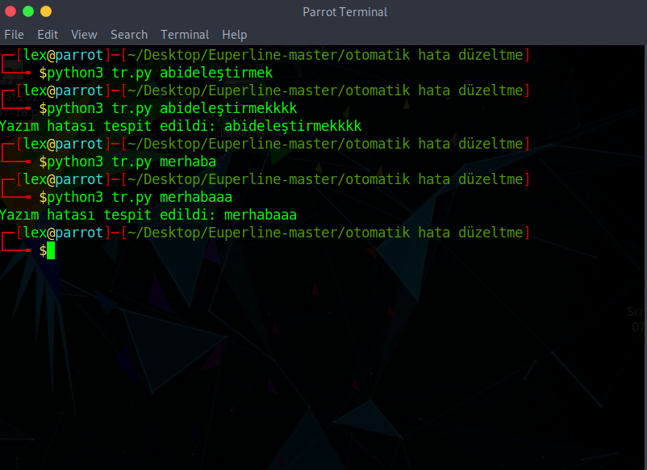

# ➤ Otomatik Hata Düzeltme Çalıştırmadan Önce İndirmeniz Gerekenler
```

sudo apt-get install python3

```
# ➤ Otomatik Hata Düzeltmeyi Çalıştırmak İçin
```
python tr.py ...


Üç nokta yerine (...) istediğiniz kelime veya cümleyi yazınız

Otomatik hata düzeltme bünyesinde bulunan kelime ve cümle hazneleri sayesinde yazmış olduğunuz kelime ve cümlelerin hatalı olup olmadığını size bildirmektedir. Toplamda 60-70 bin kadar kelime ve cümle yapısına sahip bir sistemdir.
```



# ➤ EUPERLINE LINUX SYSTEMS...

                          .
                         ...
                        .....
                       .......
                      .........
                       .......
                .       .....       .
               ...       ...       ...
              .....       .       .....
             .......             .......
            .........           .........
           .........             .........
          .........       .       .........
         .........       ...       .........
        .........       .....       .........
       .........       .......       .........
      .........       .........       .........

# ➤ :book: LINKS

Web Sitesi : [euperline.com](euperline.com)
</br>
Instagram : [instagram.com](https://www.instagram.com/euperlineofficial/)
</br>
LinkedIn :  [linkedin.com](https://www.linkedin.com/company/euperline/)

